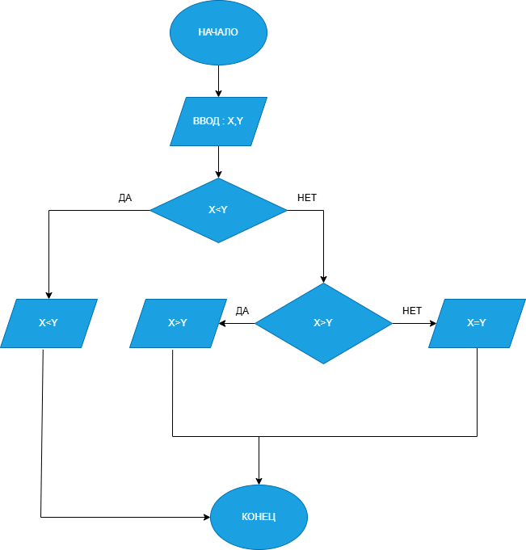

# Домашняя работа к лабораторной работе 6.
## Условия задачи:
Написать программу, которая выводит результат сравнения двух
введенных пользователем чисел в виде математического выражения (X<Y
или X=Y или X>Y).
## 1. Алгоритм и блок схема:
### Алгоритм:
1. Начало
2. Задать переменнные:
  - float x, y
3. Создание ветвлений:
  - X<Y => X<Y
  - X=Y => X=Y
  - X>Y => X>Y
4. Вывести результаты расчётов с подстановкой значений в текст.
5. Конец

### Блок схема

## 2. Реализация программы:
## 3. Результат работы программы

## 4. Информация о разработчике
Лаврова Мария, бИПТ-252# Lab6
